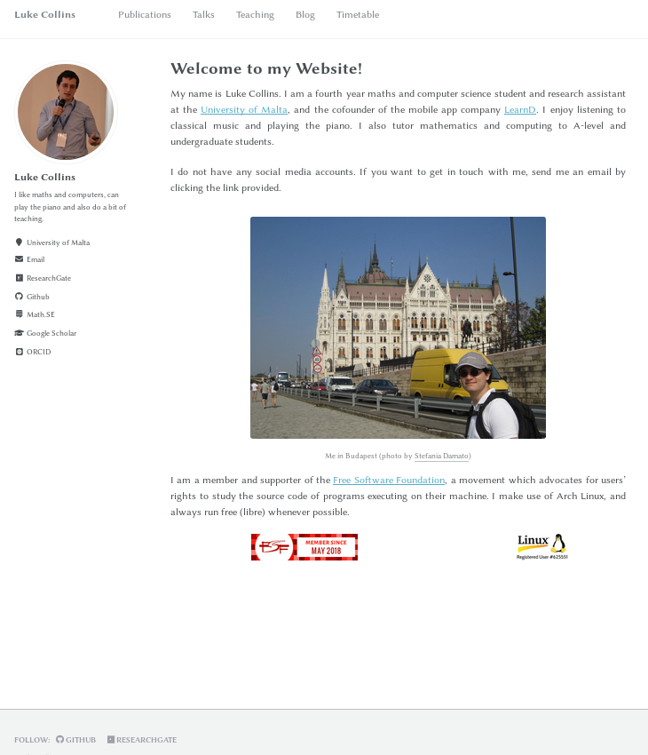

# Personal Website

This is a simple website built using [Jekyll](https://jekyllrb.com/), based off the [academicpages](https://github.com/academicpages/academicpages.github.io) theme.

  

## License
This project is distributed under the MIT license.
